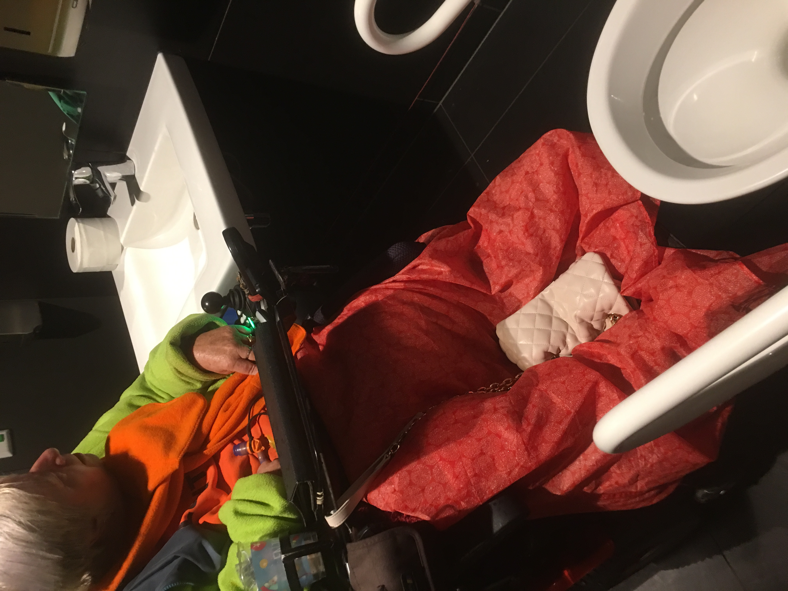
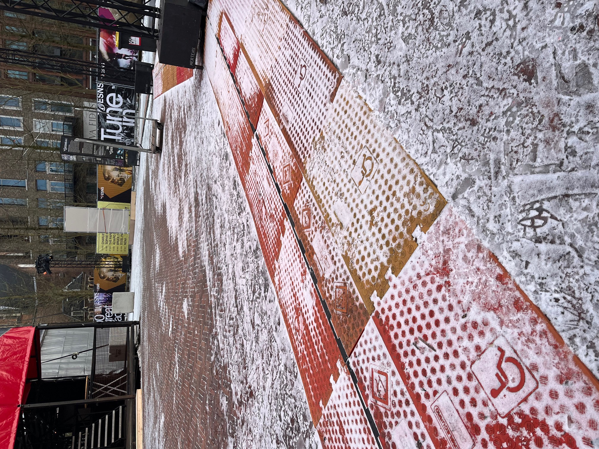
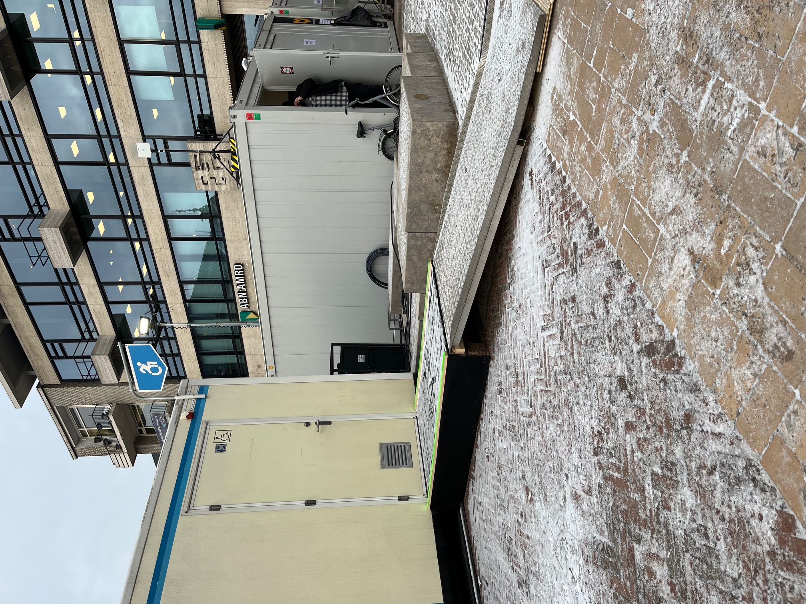

<!-- .slide: data-menu-title="Frontpage"; data-background-image="images/Diversity-accessibility.jpg"; data-background-opacity="0.2"; background-size:contain -->
# Uitdagingen mobiliteitsbeperking
12-2-2024

Note:
- Printen: kan vanuit Chrome met url suffix: ?print-pdf
- f = full screen (escape to exit)
- o = overview slides
- g = go to slide
- s = speaker notes
- v,b,.,/ = pause/resume

---

<!-- .slide: data-menu-title="Om swie gaat het"; data-background-image="images/Diversity-accessibility.jpg"; data-background-opacity="0.2"; background-size:cover -->
## Om wie gaat het

 1. Rolstoelers
 2. Kinderwagens
 3. Rollators
 4. Beperkte energie
 5. Stoklopers
 6. Scootmobiel
 7. ...

---

## Het is soms lastig...

<!-- .element height="30%" width="30%" -->

--

## Trottoir (1)

<!-- .element height="40%" width="40%" -->

--

## Trottoir (2)

<!-- .element height="60%" width="60%" -->

--

# Trottoir (3)

<!-- .element height="60%" width="60%" -->

-  Parkeerbord verspert stoep

--

## OV - abri

<!-- .element height="40%" width="40%" -->

-  Kun je op de verhoging komen?
-  Kan je er tussendoor?
-  Kun je schuilen bij regen?

--

## Entree

<!-- .element height="50%" width="50%" -->

--

## Lift (1)

<!-- .element height="40%" width="40%" -->

- Stuurfoutje en ...

--

## Lift (2)

<!-- .element height="40%" width="40%" -->

--

## Sanitair

<!-- .element height="40%" width="40%" -->

--

## Uitstallingen

<!-- .element height="40%" width="40%" -->

--

## Evenementzaal

<!-- .element height="40%" width="40%" -->

- Lekker bioscoop kijken?

Note:
- Plan rolstoelplekken: zo moet het niet.
- Bovendien wil je toch naast je medebezoeker zitten: samen uit?

--

<!-- .slide: data-menu-title="Afval" -->
## Containers (1)
<!-- .element height="40%" width="40%" -->
<!-- .slide: data-menu-title="Toegankelijkheid plannen (3)" -->

--

## Containers (2)

<!-- .element height="40%" width="40%" -->

---

## Daar is over nagedacht...

<!-- .element height="30%" width="30%" -->

--

## Ontvangst

<!-- .element height="50%" width="50%" -->

Note:
- verlaagde balie: vriendelijke (foto)

--

## Restaurant

<!-- .element height="50%" width="50%" -->

--

## Lift

<!-- .element height="60%" width="60%" -->

Note:
- Spiegel op achterwand lift

--

## Sanitair (1)

<!-- .element height="40%" width="40%" -->

--

## Sanitair (2)

<!-- .element height="40%" width="40%" -->

--

## Sanitair (3)

<!-- .element height=460%" width="40%" -->

--

## ESNS (1)

<!-- .element height=460%" width="40%" -->

--

## ESNS (2)

<!-- .element height=460%" width="40%" -->

---

<!-- .element height="90%" width="90%" -->

**Bedankt voor uw aandacht!**
