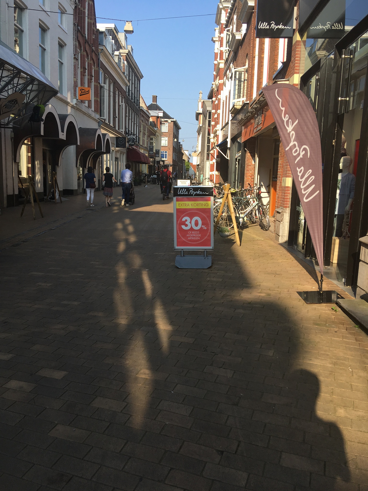

<!-- .slide: data-menu-title="Frontpage"; data-background-image="images/accessibility4pics.png"; data-background-opacity="0.2"; background-size:contain -->
# Uitdagingen mobiliteitsbeperking
12-2-2024

Note:
- Printen: kan vanuit Chrome met url suffix: ?print-pdf
- f = full screen (escape to exit)
- o = overview slides
- g = go to slide
- s = speaker notes
- v,b,.,/ = pause/resume

---

<!-- .slide: data-menu-title="Introductie (1)"; data-background-image="images/accessibility4pics.png"; data-background-opacity="0.1"; background-size:contain -->
## Om wie gaat het

 1. Rolstoelers
 2. Kinderwagens
 3. Rollators
 4. Beperkte energie
 5. Stoklopers
 6. Heupdisplacie
 7. ...

---

## OV - abri

<!-- .element height="40%" width="40%" -->

-  Soms kun je niet eens op de verhoging komen
-  Je kunt er nauwelijks tussendoor
-  Je kunt nauwelijks schuilen bij regen

--

## Aanlooproute (1)

<!-- .element height="30%" width="30%" -->
<!-- .element height="30%" width="30%" -->

--

# Aanlooproute (2)

<!-- .element height="80%" width="80%" -->

--

<!-- .slide: data-background-image="images/20120411-Feithhuis-Groningen.jpg"; data-background-opacity="0.2"; background-size:contain -->
## Entree

<!-- .element height="50%" width="50%" -->

Note:
Gebruikelijk argument: hier komt nooit iemand met een rolstoel
Dat is nogal logisch als je met een rolstoel daar niets kunt
Simpel kip en ei verhaal!

--

## Ontvangst

<!-- .element height="50%" width="50%" -->

Note:
- verlaagde balie: vriendelijke (foto)

--

## Doorgankelijkheid

<!-- .element height="30%" width="30%" -->

--

## Lift

<!-- .element height="40%" width="40%" -->
<!-- .element height="40%" width="40%" -->

Note:
- Spiegel op achterwand lift

--

## Sanitair

Note:
- MiVa-Toilet ontbreekt nog papierrolhouder em handdoek: in overleg met ervaringsdeskundigen

--

## Restaurant

<!-- .element height="40%" width="40%" -->

--

## Terras

<!-- .element height="50%" width="50%" -->

--

## Evenementzaal

<!-- .element height="50%" width="50%" -->

- Fijne rolstoelplaats?

Note:
- Plan rolstoelplekken: zo moet het niet.
- Bovendien wil je toch naast je medebezoeker zitten: samen uit?

--

## Uitgang

<!-- .element height=" 20%" width="20%" -->

- Nooduitgang doorgankelijk?

--

<!-- .slide: data-menu-title="Toegankelijkheid plannen (2)" -->
## Zones in straten

<!-- .element height="70%" width="40%" -->
<!-- .element height="70%" width="40%" -->

Note:
- Is er een loopzone zonder obstakels?
- Hoe breed?

--

<!-- .slide: data-menu-title="Toegankelijkheid plannen (3)" -->
## Containers
<!-- .element height="40%" width="40%" -->
<!-- .element height="40%" width="40%" -->

Note:
- Meedoen aan de maatschappij wordt je niet altijd makkelijk gemnaakt
-  Tuintje is Goed bedoeld, maar niet afgestemd en ios belemmerend

---

<!-- .element height="90%" width="90%" -->

**Bedankt voor uw andacht!**
