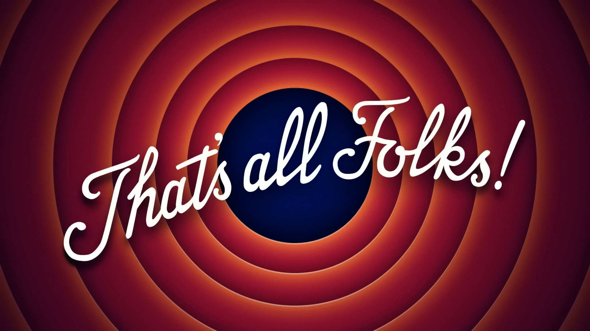

<!-- .slide: data-menu-title="Frontpage"; data-background-image="images/accessibility4pics.png"; data-background-opacity="0.2"; background-size:contain -->
# Uitdagingen mobiliteitsbeperking
12-2-2024

Note:
- Printen: kan vanuit Chrome met url suffix: ?print-pdf
- f = full screen (escape to exit)
- o = overview slides
- g = go to slide
- s = speaker notes
- v,b,.,/ = pause/resume

---

<!-- .slide: data-menu-title="Agenda" data-background-image="images/stopwatch.jpg" data-background-opacity="0.1" -->
## Om wie gaat het

 1. Rolstelers
 2. Kinderwagens
 3. Rollators
 4. Beperkte energie
 5. Heupdisplacie
 6. ...

---

<!-- .slide: data-menu-title="Introductie (1)"; data-background-image="images/accessibility4pics.png"; data-background-opacity="0.1"; background-size:contain -->
## Wat is Toegankelijkheid

VN-Verdrag Handicap - 2016   <!-- .element: class="fragment" data-fragment-index="1" -->

 Fysieke toegankelijkheid    <!-- .element: class="fragment" data-fragment-index="2" -->

 Maar ook: Kunnen deelnemen aan de maatschappij:    <!-- .element: class="fragment" data-fragment-index="3" -->

 Vervoer, Zorg          <!-- .element: class="fragment" data-fragment-index="4" -->

 Onderwijs, Werk        <!-- .element: class="fragment" data-fragment-index="5" -->

 Sport, vrije tijd      <!-- .element: class="fragment" data-fragment-index="6" -->

 etc.                    <!-- .element: class="fragment" data-fragment-index="6" -->

Note:
- Fysieke toegankelijkheid is randvoorwaarde, als je er niet kunt komen...

--

<!-- .slide: data-menu-title="Introductie (2)"; data-background-image="images/accessibility4pics.png"; data-background-opacity="0.1"; background-size:contain -->
## Ook in communicatie 

- Website toegankelijkheid (screen readers)

- Toegankelijke documenten (PDF)

- Kleurgebruik

- Tekst in foto's

- Tolk Nederlandse Gebaren Taal

- Audio descriptie

--

<!-- .slide: data-menu-title="Introductie (3)"; data-background-image="images/accessibility4pics.png"; data-background-opacity="0.1"; background-size:contain -->
## Ook in beeldvorming 

Gemeentelijke communicatie:

- Presentatiemateriaal
- Foto's

is vast wel inclusief v.w.b. etniciteit en man/vrouw

Maar gebruikt u ook gewone afbeeldingen met:
- Rolstoeler
- Blinde/slechtziende
- Audiodescriptie / Tolk

---

<!-- .slide: data-menu-title="Introductie (4)" data-transition="zoom" -->
## Om wie gaat het

<!-- .element height="55%" width="55%" -->

Note:
- De doelgroep is groter, rekening houden met Motorische handicap betekent ook: rollator, kinderwagens

--

<!-- .slide: data-menu-title="Introductie (6)" data-transition="zoom" -->
## Hulp bij gastvrijheid

<!-- .element height="55%" width="55%" -->

Note: 
- Zie we website van "De week van de Toegankelijkheid"

---

<!-- .slide: data-menu-title="Toelichting website (1)" -->
## Toelichting website

Gastvrijheid                 <!-- .element: class="fragment" data-fragment-index="1" -->

Betrokkenheid laten zien     <!-- .element: class="fragment" data-fragment-index="2" -->

Bewustwording vergroten      <!-- .element: class="fragment" data-fragment-index="3" -->

Stimuleren                   <!-- .element: class="fragment" data-fragment-index="4" -->

Note:
- VN-Verdrag Handicap (2016), volwaardig deelnemen aan de maatschappij
  geleidelijke verandering naar Toegankelijke maatschappij
- Gastvrijheid: toegankelijkheids informatie als service - iedere gast is er 1 en is omzet
- Betrokkenheid laten zien, uitdragen visie
- Bewustwording vergroten, bij consumenten en ondernemers
- Toegankelijkheid is niet alleen issue voor rolstoelen, ook scootmobielen, blinden, rollators, kinderwagens
- Gebruikelijk argument: hier komt nooit iemand met een rolstoel, dat is nogal logisch zonder voorzieningen
  Simpel kip en ei verhaal!

---

<!-- .slide: data-menu-title="Toelichting website (2)" -->
## Waarom deze website

- Wat is ToegankelijkGroningen.nl        <!-- .element: class="fragment" data-fragment-index="1" -->

- Waarom is het nodig, wat lost het op?  <!-- .element: class="fragment" data-fragment-index="2" -->

- ToegankelijkGroningen.nl vs. Google    <!-- .element: class="fragment" data-fragment-index="3" -->

Note:
- Wat is ToegankelijkGroningen.nl
  - TG2.0 is het platform voor Toegankelijkheids informatie van de Provincie Groningen
  - Samenwerking zaVie, Marketing Groningen en IT bedrijf Insiders
  - Insiders breidt datamodel uit, Mkt Gn ondernemers vullen de database en zaVie controleert steekproefsgewijs
  - Daarnaast worden niet toeristische objecten toegevoegd door zaVie
  - Op VisitGroningen.nl high level Toegankelijkheid, op ToegankelijkGroningen.nl gedetailleerd en gecatagoriseerd
- Waarom is het nodig, wat lost het op?
  - Bruikbare informatie over toegankelijkheid is nu nauwelijks te vinden
  - Bronnen zijn nu websites, apps, reviews etc.  Maar wat heb je nu aan bijv. rolstoelvriendelijk?
  - Een handicap is geen identiteit, maar slechts 1 aspect van wie je bent, als ieder ander willen we allemaal wat anders
  - Betrouwbare informatie op 1 plek
  - Feedback van gebruikers (community) verwerkt door zaVie
- ToegankelijkGroningen.nl vs. Google?
  - Google is op zich een mooi community initiatief, maar:
    - Beperkte informatie, veelal onvoldoende
    - Community in theorie goede oplossing, maar ontbreken van controle beperkt kwaliteit

---

<!-- .slide: data-menu-title="Frontpage"; data-background-image="images/accessibility4pics.png"; data-background-opacity="0.2"; background-size:contain -->
# Toelichting website

<!-- .element height="56%" width="60%" -->

--

<!-- .slide: data-menu-title="Website inhoud (1)" -->
## Content \& Contact

- Website
  - Naam
  - Omschrijving
  - Categorie(en)
  - website url
  
- Adres 
  - Adres locatie
  - Contact informatie
  - Openingstijden: pagina Kalender 

Note:
- Website content pagina is alleen (structuur) voor ToegankelijkGroningen.nl
- Pagina's Call to action, Media en prijzen zijn vanuit VisitGroningen

--

## Toegankelijkheid

Toegankelijk voor:
- Mensen met een Auditieve beperking
- Mensen met een Mobiliteit beperking
- Mensen met eenVisuele beperking

Faciliteiten:
- Persoonlijke begeleiding
- Minder valide toilet
- Hulp- of geleidehond toegestaan
- Ringleiding aanwezig

Note:
- Auditieve: bijvoorbeeld ook balie ringleiding voor slechthorenden
- Visuele: begeleiding naar bijv. zitplaats

--

## OV

- Afstand tot halte of entree
- Route naar halte of entree obstakelvrij
- Route met contrastmarkering/geleidelijn?

<!-- .element height="40%" width="40%" -->

Note:
- Geleidelijn:
  - moet veilige route voor blinde/slechtziende zijn
  - Gemeente en aannemer moeten beter bewust worden
  - Handhaven helaas niet wettelijk verplicht

--

## OV - abri

<!-- .element height="40%" width="40%" -->

-  Soms kun je niet eens op de verhoging komen
-  Je kunt er nauwelijks tussendoor
-  Je kunt nauwelijks schuilen bij regen

--

## Parkeren

- Parkeerplaats(en) op eigen terrein
- Gehandicaptenparkeerplaats op eigen terrein?

--

## Aanlooproute (1)

- Route (van parkeerplaats) naar entree obstakelvrij
- Route (van parkeerplaats) naar entree verhard?
- Stoeprand verlaagd
- Hellingbaan aanwezig

<!-- .element height="30%" width="30%" -->
<!-- .element height="30%" width="30%" -->

--

# Aanlooproute (2)

<!-- .element height="40%" width="40%" -->
<!-- .element height="40%" width="40%" -->

Note:
- Niet alleen issue voor rolstoelen, ook blinden, rollators, kinderwagens
- Bewustwording overheid & uitvoerders
- Bewustwording burgers, vooral in de stad Groningen is fietsoverlast een groot probleem.

--

<!-- .slide: data-background-image="images/20120411-Feithhuis-Groningen.jpg"; data-background-opacity="0.2"; background-size:contain -->
## Entree

- Hoofdingang toegankelijk
- Alternatieve ingang (indien niet)
- Entreedeur drempelvrij (max. 2 cm)
- Deurbel bereikbaar?
- Entreedeur automatisch
- Tussendeur (met dranger)
- Opstelruimte bij deur (scootmobiel/rollator)
- Oplaadpunten accu's (scootmobiel/fiets)

<!-- .element height="20%" width="20%" -->

Note:
Gebruikelijk argument: hier komt nooit iemand met een rolstoel
Dat is nogal logisch als je met een rolstoel daar niets kunt
Simpel kip en ei verhaal!

--

## Ontvangst

- Balie aanwezig
- Balie aanwezig bij entree
- Balie verlaagd bij entree
- Zitgelegenheid bij balie
- Draagbare pin-automat bij balie
- Pin met relief (slechtzienden)

<!-- .element height="50%" width="50%" -->

Note:
- verlaagde balie: vriendelijke (foto)

--

## Doorgankelijkheid

- Contrasterende bewegwijzering
- Gebouw drempelvrij
- Gebouw rolstoel toegankelijk
- Glazen scheidingswanden/deuren

<!-- .element height="30%" width="30%" -->

Note:
- Bewegwijzering contrast (slectziend) en kleustelling (kleurenblind)
- Voor slechtzienden zijn glazen wanden een risico (stickeren)

--

## Lift

- Personenlift aanwezig
- Liftdeur electrisch
- Liftdeur te openen via knop op de wand
- Lift bedienbaar vanuit rolstoel
- Lift bedieningspaneel met relief
- Verdiepingen hoorbaar aangegeven

<!-- .element height="40%" width="40%" -->
<!-- .element height="40%" width="40%" -->

Note:
- Spiegel op achterwand lift

--

## Trap

- Trap met contrasterende markering
- Trap met leuning aan 1 zijde
- Trap met leuning aan beide zijden
- Trap met doorlopende leuning
- Traplift aanwezig

<!-- .element height="50%" width="50%" -->

Note:
- Paaltje in trapafgang

--

## Sanitair

- Bewegwijzering naar toilet
- Route toilet obstakelvrij
- Vrije draaicirkel 150 cm in toilet
- Toilet met armsteunen/beugels
- Wastafel onderrijdbaar
- Kraan bedienbaar vanuit rolstoel
- Alarmkoord aanwezig
- Spegel bruikbaar rolstoeler (onderkant 70 cm)
- Verschoonvoorziening

--

Note:
- MiVa-Toilet ontbreekt nog papierrolhouder em handdoek: in overleg met ervaringsdeskundigen

--

## Restaurant

- Route naar tafel obstakelvrij
- Tafels onderrijdbaar (min. 70 cm)
- Stoelen met rug en armleuningen
- Tafels verlicht

<!-- .element height="40%" width="40%" -->

--

## Hotel

- Route naar kamer drempelvrij
- Route met versmallingen
- Kamerdeur met weinig kracht te openen
- Hoogte lichtschakelaar
- Voldoende opstelruimte naast bed
- Is er een hoog/laag bed
- Badkamerdeur met weinig kracht te openen
- Spiegel bruikbaar rolstoeler (onderkant 70 cm)
- Badkamner voorzien van anti-slip
- Douchezitje aanwezig
- Douchezitje met armsteunen
- Douchekraan binnen handbereik

--

## Bar

- Route naar bar drempelvrij
- Route naar bar minimaal 80 cm breed
- Route naar bar met versmallingen

--

## Terras

- Doorgang naar terras voldoende breed (80 cm)
- Tafels onderrijdbaar (min. 70 cm)
- Stoelen met rug en armleuningen
- Tafels verlicht
- Parasols aanwezig

<!-- .element height="30%" width="30%" -->

--

## Evenementzaal

- Zaal met goede akoestiek
- Aangepaste zit/rolstoelplaatsen
- Rolstoelplaatsen beschikbaar
- Rolstoelplaatsen vooraf reserveren
- Pauze voorzieningen goed bereikbaar
- Rolstoeltoegankelijke garderobe

<!-- .element height="20%" width="20%" -->

Note:
- Plan rolstoelplekken: zo moet het niet.
- Bovendien wil je toch naast je medebezoeker zitten: samen uit?

--

## Uitgang

- Nooduitgang toegankelijk
- Vluchtroute drempelvrij
- Vluchtroute verhard
- vluchtroute breed genoeg (80 cm)
- Vluchtroute met hellingbaan
  - Lengte hellingbaan
  - Hoogteverschil hellingbaan
- Nooddeur met weing kracht te openen

<!-- .element height=" 20%" width="20%" -->

---

<!-- .slide: data-menu-title="Toegankelijkheid plannen (1)" data-background-image="images/puzzle.jpg" data-background-opacity="0.1" background-size: contain -->
## Toegankelijkheid plannen

Betrek ervaringsdeskundigen

Vanaf de gebiedsvisie

Toegankelijkheid meenemen in PvE

Hoeft niet meer te kosten!

--

<!-- .slide: data-menu-title="Toegankelijkheid plannen (2)" -->
## Zones in straten

<!-- .element height="70%" width="40%" -->
<!-- .element height="70%" width="40%" -->

Note:
- Is er een loopzone zonder obstakels?
- Hoe breed?

--

<!-- .slide: data-menu-title="Toegankelijkheid plannen (3)" -->
## Containers
<!-- .element height="40%" width="40%" -->
<!-- .element height="40%" width="40%" -->

Note:
- Meedoen aan de maatschappij wordt je niet altijd makkelijk gemnaakt
-  Tuintje is Goed bedoeld, maar niet afgestemd en ios belemmerend

---

<!-- .slide: data-menu-title="Vragen" data-transition="convex" -->
##  Vragen

<!-- .element height="90%" width="90%" -->

---

## Tekening lezen 

Korte introductie tekening lezen <!-- .element: "r-fit-text" -->

---

<!-- .element height="90%" width="90%" -->

**Bedankt voor uw deelname!**
